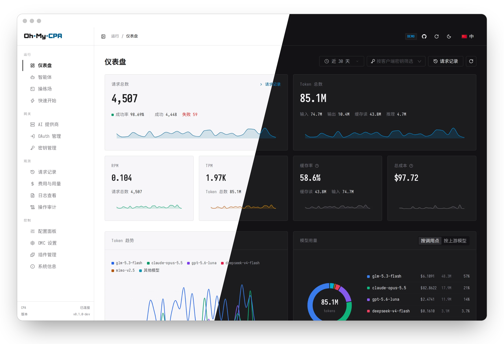
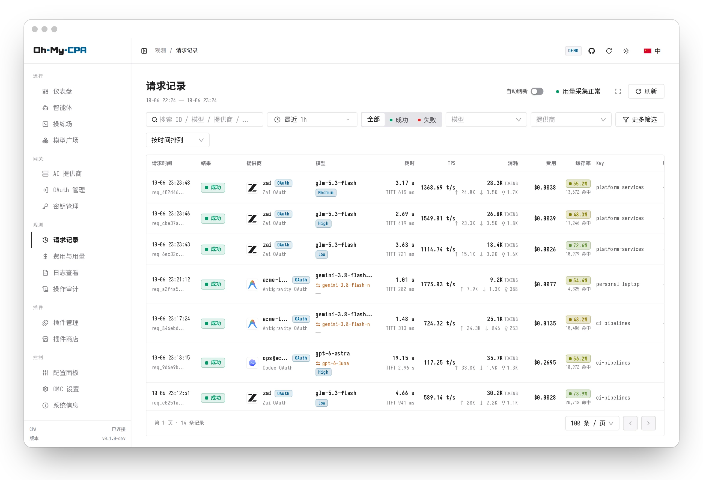
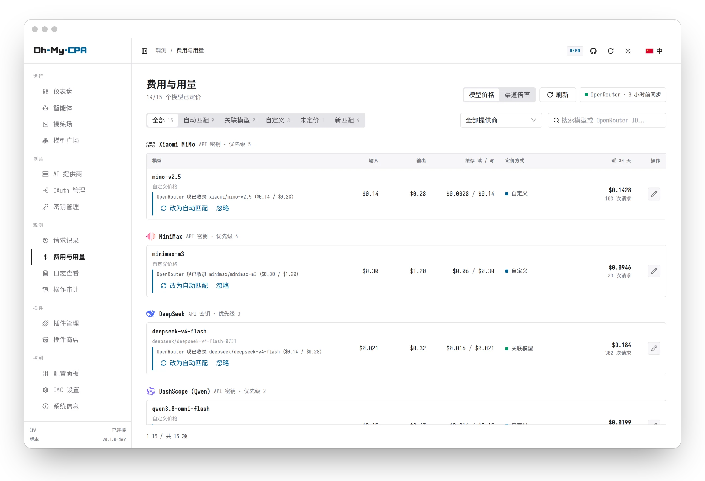
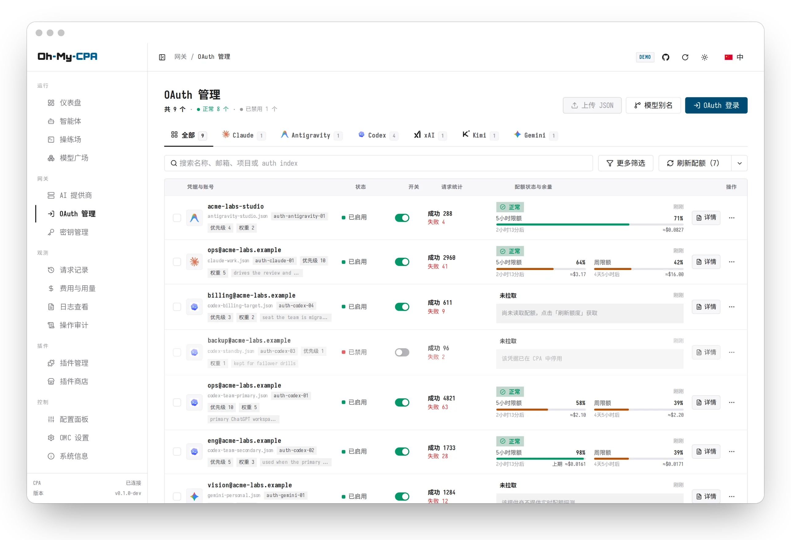
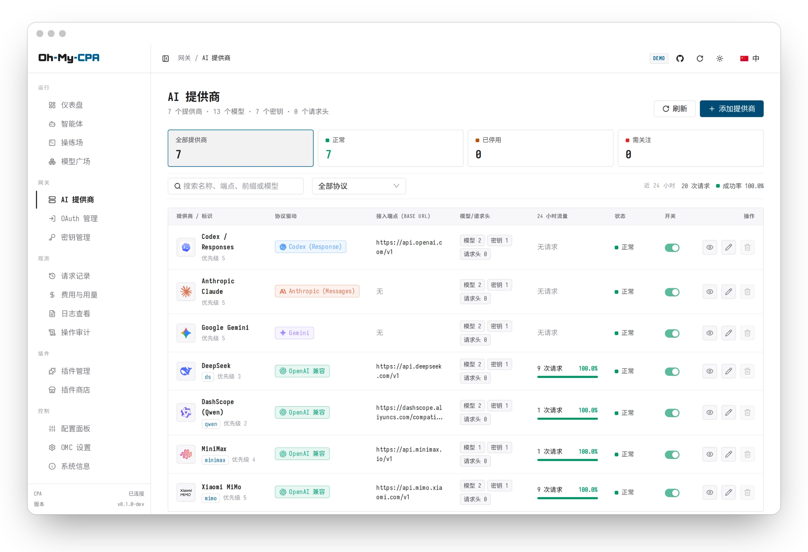
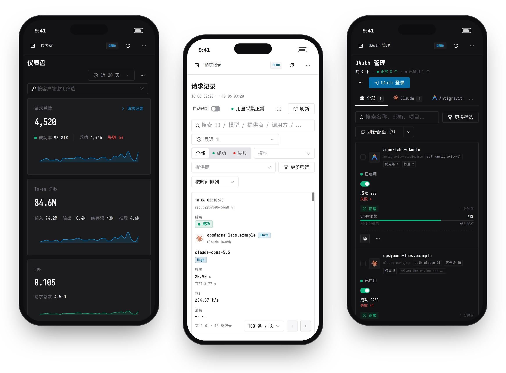

<div align="center">

<picture>
  <source media="(prefers-color-scheme: dark)" srcset="web/src/assets/brand/omc-wordmark-dark.svg">
  <source media="(prefers-color-scheme: light)" srcset="web/src/assets/brand/omc-wordmark-light.svg">
  
</picture>

### 集中管理 API 与 OAuth，可视化观测请求、成本、用量

MCP · 可视化 · 管理

<br />

[](https://github.com/WizisCool/oh-my-cpa/releases)
[](https://github.com/WizisCool/oh-my-cpa/actions/workflows/ci.yml)
[](https://github.com/WizisCool/oh-my-cpa/stargazers)
[](https://hub.docker.com/r/wiziscool/oh-my-cpa)
[](https://github.com/router-for-me/CLIProxyAPI)
[](LICENSE)

<br />

**[在线演示](https://omc-demo.junze.dev)** ·
[安装](#安装) ·
[功能特性](#功能特性) ·
[智能体与 MCP](#智能体与-mcp) ·
[文档](#文档) ·
[English](README.md)

<br />

<a href="https://omc-demo.junze.dev">
  
</a>

</div>

[CLIProxyAPI](https://github.com/router-for-me/CLIProxyAPI)（CPA）是一个 API 网关，负责协议适配、凭据管理与请求代理。
**Oh My CPA**（OMC）是配套的 Web 控制台：管理网关的提供商、凭据与配置，并记录每条请求的用量与费用（CPA 本身不保存这些记录）。
OMC 是单个 Go 二进制文件，内嵌 React 控制台，数据存放在本地 SQLite，可离线运行，登录使用 CPA 的管理密钥。

<table>
<tr>
<td width="25%" valign="top">

### 观测

实时仪表盘、全年 Token 热力图，以及可按多个维度筛选的请求记录，包含耗时、首字延迟、Token 与费用。

</td>
<td width="25%" valign="top">

### 管理

提供商、OAuth 登录、客户端密钥、配额、插件，以及 CPA 的 `config.yaml`，表单或 YAML 两种方式均可编辑。模型广场按厂商列出客户端可调用的模型名，并给出价格、近期请求与 models.dev 规格资料。

</td>
<td width="25%" valign="top">

### 计费

每条请求的费用在完成时确定。价格取自 OpenRouter 或自定义费率，之后调价不影响已有记录。

</td>
<td width="25%" valign="top">

### 自动化

内置智能体与 MCP 服务通过预先声明的能力操作控制台，低风险写入之外的变更需经批准后执行。

</td>
</tr>
</table>

[在线演示](https://omc-demo.junze.dev) 提供带工具调用与生成式 UI 的智能体示例，以及操练场示例；均为本地回放，不调用模型。
会话 HTML 保持生成式界面和工具链的原有顺序，PNG 也能展示生成式 UI。

## 界面截图

<table>
<tr>
<td width="50%" valign="top">
<picture>
  <source media="(prefers-color-scheme: dark)" srcset="docs/images/readme/usage-events-dark.zh.webp">
  
</picture>
<p align="center"><b>请求记录</b><br />按模型、提供商、密钥、状态与费用筛选每一条请求</p>
</td>
<td width="50%" valign="top">
<picture>
  <source media="(prefers-color-scheme: dark)" srcset="docs/images/readme/pricing-dark.zh.webp">
  
</picture>
<p align="center"><b>费用与用量</b><br />自动匹配 OpenRouter 价格，也可自定义覆盖</p>
</td>
</tr>
<tr>
<td width="50%" valign="top">
<picture>
  <source media="(prefers-color-scheme: dark)" srcset="docs/images/readme/oauth-management-dark.zh.webp">
  
</picture>
<p align="center"><b>OAuth 管理</b><br />登录、查看配额、配置凭据，集中在一处完成</p>
</td>
<td width="50%" valign="top">
<picture>
  <source media="(prefers-color-scheme: dark)" srcset="docs/images/readme/ai-providers-dark.zh.webp">
  
</picture>
<p align="center"><b>AI 提供商</b><br />端点、模型、优先级，以及由网关执行的启停开关</p>
</td>
</tr>
</table>

以上截图跟随 GitHub 主题切换。控制台支持浅色、深色与跟随系统三种模式，每种模式有三套内置配色和一套自定义配色。

<div align="center">
  
  <p><b>移动端布局。</b>每个页面都适配窄屏。</p>
</div>

## 安装

### 通过 Agent 安装

将以下内容交给 Claude Code、Codex、Cursor 或其他 Agent。Agent 会检查机器现状，选择合适的安装方式并执行：

```text
按照这份指南帮我安装 Oh My CPA：
https://raw.githubusercontent.com/WizisCool/oh-my-cpa/master/docs/install-for-agents.md
```

### 通过 Docker Compose 安装

环境要求：Docker Engine（含 Compose 插件），CLIProxyAPI v8.0.0 及以上。
命令按 Linux 或 macOS 终端编写，需要 `curl` 与 `openssl`。控制台的登录密码是 CPA 的管理密钥。

| 安装场景 | 方案 |
| --- | --- |
| 尚未部署 CPA | [全新安装](#全新安装) |
| CPA 由 Docker Compose 部署 | [已经安装了 CLIProxyAPI](#已经安装了-cliproxyapi) |
| CPA 以其他方式部署 | [独立部署](#独立部署) |

#### 全新安装

新建一个目录，将以下内容保存为 `compose.yml`：

```yaml
services:
  cli-proxy-api:
    image: eceasy/cli-proxy-api:latest
    restart: unless-stopped
    ports:
      - "127.0.0.1:8317:8317"
    environment:
      MANAGEMENT_PASSWORD: ${CPA_MANAGEMENT_KEY:?}
    volumes:
      - ./config.yaml:/CLIProxyAPI/config.yaml
      - ./auths:/root/.cli-proxy-api
      - ./logs:/CLIProxyAPI/logs
      - ./plugins:/CLIProxyAPI/plugins

  oh-my-cpa:
    image: wiziscool/oh-my-cpa:latest
    restart: unless-stopped
    depends_on:
      - cli-proxy-api
    ports:
      - "127.0.0.1:8080:8080"
    environment:
      OMCPA_CPA_BASE_URL: http://cli-proxy-api:8317
      OMCPA_CPA_MANAGEMENT_KEY: ${CPA_MANAGEMENT_KEY:?}
      OMCPA_MASTER_KEY: ${OMCPA_MASTER_KEY:?}
      OMCPA_DATA_DIR: /data
    volumes:
      - oh-my-cpa-data:/data

volumes:
  oh-my-cpa-data:
```

在该目录下载 CPA 的初始配置，生成两个密钥，并启动两个服务：

```bash
curl -fsSL https://github.com/WizisCool/oh-my-cpa/releases/latest/download/cpa.config.example.yaml -o config.yaml
printf 'CPA_MANAGEMENT_KEY=%s\nOMCPA_MASTER_KEY=%s\n' "$(openssl rand -hex 24)" "$(openssl rand -hex 32)" > .env
chmod 600 .env
docker compose up -d
```

访问 **`http://127.0.0.1:8080/omc/`**，以 `.env` 中 `CPA_MANAGEMENT_KEY` 的值登录。
提供商与客户端密钥在控制台中添加；客户端请求发往 CPA：`http://127.0.0.1:8317`。

#### 已经安装了 CLIProxyAPI

在运行 CPA 的编排文件的 `services:` 下添加以下服务；文件已有顶层 `volumes:` 时，
将 `oh-my-cpa-data:` 并入其中。`cli-proxy-api` 是 CPA 官方编排文件中的服务名，服务名不同时替换为实际名称。

```yaml
  oh-my-cpa:
    image: wiziscool/oh-my-cpa:latest
    restart: unless-stopped
    ports:
      - "127.0.0.1:8080:8080"
    environment:
      OMCPA_CPA_BASE_URL: http://cli-proxy-api:8317
      OMCPA_CPA_MANAGEMENT_KEY: ${OMCPA_CPA_MANAGEMENT_KEY:?}
      OMCPA_MASTER_KEY: ${OMCPA_MASTER_KEY:?}
      OMCPA_DATA_DIR: /data
    volumes:
      - oh-my-cpa-data:/data

volumes:
  oh-my-cpa-data:
```

在同一目录的 `.env` 中添加两行：

```dotenv
OMCPA_CPA_MANAGEMENT_KEY=<CPA 管理密钥的明文，而非 config.yaml 中的哈希>
OMCPA_MASTER_KEY=<openssl rand -hex 32 的输出>
```

执行 `docker compose up -d oh-my-cpa`，CPA 容器保持原样运行，不会重启。
访问 **`http://127.0.0.1:8080/omc/`**，以管理密钥登录。

#### 独立部署

新建一个目录，将以下内容保存为 `compose.yml`。`OMCPA_CPA_BASE_URL` 是从容器内部访问 CPA 的地址：
下面的值适用于 CPA 在同一台机器上并监听所有网卡的情况，其他情况见[连接 CPA](docs/install.md#reaching-cpa)。

```yaml
services:
  oh-my-cpa:
    image: wiziscool/oh-my-cpa:latest
    restart: unless-stopped
    ports:
      - "127.0.0.1:8080:8080"
    extra_hosts:
      - host.docker.internal:host-gateway
    environment:
      OMCPA_CPA_BASE_URL: http://host.docker.internal:8317
      OMCPA_CPA_MANAGEMENT_KEY: ${OMCPA_CPA_MANAGEMENT_KEY:?}
      OMCPA_MASTER_KEY: ${OMCPA_MASTER_KEY:?}
      OMCPA_DATA_DIR: /data
    volumes:
      - oh-my-cpa-data:/data

volumes:
  oh-my-cpa-data:
```

在同一目录创建 `.env`：

```dotenv
OMCPA_CPA_MANAGEMENT_KEY=<CPA 管理密钥的明文，而非 config.yaml 中的哈希>
OMCPA_MASTER_KEY=<openssl rand -hex 32 的输出>
```

执行 `docker compose up -d`，然后访问 **`http://127.0.0.1:8080/omc/`**，以管理密钥登录。

### 安装原生可执行文件

[标签发布](https://github.com/WizisCool/oh-my-cpa/releases)提供 macOS（Darwin）、Windows、
Linux 和 FreeBSD 的 amd64、arm64 可执行文件。每个压缩包内嵌控制台，并附环境变量模板；
下载后请按该发布的 `checksums.txt` 校验 SHA-256。无需 Go、Node 或 Docker，CPA 需单独安装。
配置、权限及升级步骤见[原生安装指南](docs/install.md#native-executable)。

### 注意事项

> [!IMPORTANT]
> 备份 `.env`。`OMCPA_MASTER_KEY` 是数据库的加密密钥，丢失后数据无法读取。

CPA 的每条用量记录只交给一个读取方。同一个 CPA 上已有其他用量统计工具时，停用该工具，
或在 `environment:` 下添加 `OMCPA_USAGE_INGEST_MODE: "off"`，仅将 OMC 用于管理。其他管理面板不冲突。

发布版的加固编排文件、远程访问、HTTPS、源码构建、升级与排障见[安装指南](docs/install.md)（英文）。

## 功能特性

<details open>
<summary><b>网关与提供商</b></summary>

- **AI 提供商**：Codex、Claude、Gemini、Meta Muse、xAI、Vertex AI、Gemini Interactions、DeepSeek 及 OpenAI 兼容服务，统一管理凭据、模型高级选项、运行时重试与错误规则、优先级、权重、代理，以及由网关执行的启停开关。
- **OAuth 管理**：在控制台登录 Codex、Claude、Antigravity、xAI、Kimi（kimi.com 与 kimi.ai）、Devin 与 Meta Muse，或导入 Vertex 服务账号密钥。认证文件、手动令牌刷新、模型列表、Meta 配额、xAI／Antigravity 实时套餐及凭据专属别名按凭据管理；共享模型别名与禁用规则按提供商统一配置。Codex、Claude 与已支持的 Antigravity 模型组提供窗口额度估算，上一周期的数值作为参考并单独标注。
- **客户端密钥**：创建、命名与吊销网关 API Key，名称会出现在请求记录与筛选项中。
- **模型目录**：直接从上游提供商拉取模型列表。
- **操练场**：用文本与图片调试任意已路由的模型，支持流式多轮对话与请求诊断。
- **插件**：已安装插件、插件商店、类型化配置表单，以及兼容 CPA 原生管理接口和模型目录的可信插件页面。信任边界见[运维文档](docs/operations.md#plugin-pages)。

</details>

<details>
<summary><b>用量观测</b></summary>

- **仪表盘**：请求量、Token 吞吐、缓存命中率与费用，支持 15 分钟到 90 天的预设窗口、安装以来的“全部”窗口或任意自定义区间；统计数据永久保留，请求记录按保留期滚动清理，并提供全年 Token 热力图。
- **模型面板**：Token 趋势与用量环形图，可按调用点或上游模型统计，并展示费用占比。
- **请求记录**：多条件筛选与全文搜索；详情抽屉展示耗时、首字延迟、Token 明细与单请求原始日志。每条记录保留上游实际返回的模型，与请求模型不同时会被标出。
- **后台采集**：无论是否打开浏览器，用量都会通过流式订阅或轮询持续入库。
- **日志与审计**：实时查看网关日志与控制台自身的服务日志；操作审计记录只增不改，支持筛选与 JSON 导出。

</details>

<details>
<summary><b>定价与成本</b></summary>

- **请求时价格快照**：请求完成时通过不可变价格版本锁定费用。
- **OpenRouter 价目表**：依据 OpenRouter 公开列表为网关提供的每个模型定价，支持长上下文分档与分时段价格。
- **关联与自定义价格**：把模型关联到指定的 OpenRouter 条目，或自行设置费率，附带分档预设与试算器。
- **渠道倍率**：按提供商缩放其应答的全部请求，例如按 3 折计费的中转站。

</details>

<details>
<summary><b>配置与安全</b></summary>

- **双模式配置编辑**：结构化表单，或保留注释的 Monaco YAML 编辑器。
- **配置自动备份**：每次改写 `config.yaml` 之前自动保存一份加密副本，可在控制台恢复。
- **静态加密**：已存储的凭据与原始用量消息采用 AES-GCM 加密。
- **敏感操作审计**：查看密钥、下载认证文件、导出日志等操作都会写入审计日志，写入失败则拒绝执行。
- **离线运行**：所有资源内嵌于二进制文件，不访问 CDN。
- **个性化**：四种界面语言、可自定义配色的浅色与深色主题、部署时区，以及 K/M/B 或 万/亿 数字单位。

</details>

## 智能体与 MCP

**控制台内。** 在 `/agent` 页面，由 CPA 路由的模型回答问题并操作控制台：
用量与请求分析、提供商、OAuth、配额、客户端密钥、配置与定价。读操作直接执行；
变更先在服务端生成，在控制台点击「允许」后才执行。密钥、令牌与 OAuth 授权不会进入模型上下文。
回答可以混合文字与随生成逐步出现的无边框交互组件，包括本地筛选器、计算器、图解和图表。
组件沿用控制台的视觉风格；需要新数据或操作的后续请求，仍通过可审阅的对话流程处理。

**外部 Agent。** 同一套能力通过 MCP 在 `<控制台地址>/api/mcp` 提供（Streamable HTTP），
其他机器上的 Agent 凭地址和作为 Bearer 令牌的 CPA 管理密钥即可远程接入，Agent 一侧无需安装任何程序。
`/agent` 页面顶部的「外部接入」入口给出当前部署的实际地址和可直接复制的配置。

Claude Code：

```bash
claude mcp add --transport http oh-my-cpa https://cpa.example.com/omc/api/mcp \
  --header "Authorization: Bearer $OMCPA_CPA_MANAGEMENT_KEY"
```

Codex（`~/.codex/config.toml`）：

```toml
[mcp_servers.oh-my-cpa]
url = "https://cpa.example.com/omc/api/mcp"
bearer_token_env_var = "OMCPA_CPA_MANAGEMENT_KEY"
```

以 JSON 配置的客户端，例如 Cursor：

```json
{
  "mcpServers": {
    "oh-my-cpa": {
      "url": "https://cpa.example.com/omc/api/mcp",
      "headers": { "Authorization": "Bearer <CPA 管理密钥>" }
    }
  }
}
```

<details>
<summary>仅支持 stdio 的客户端</summary>

二进制自带 stdio 桥接进程，由它转发到控制台：

```json
{
  "mcpServers": {
    "oh-my-cpa": {
      "command": "/path/to/oh-my-cpa",
      "args": ["mcp"],
      "env": {
        "OMCPA_SERVER_URL": "https://cpa.example.com/omc",
        "OMCPA_CPA_MANAGEMENT_KEY": "<CPA 管理密钥>"
      }
    }
  }
}
```

</details>

外部 Agent 可以直接读取状态和执行低风险写入（如显示名称、偏好设置）。其余变更只能发起，不能批准操作、
提交密钥或完成 OAuth 登录：发起的变更会返回一个链接，在控制台中打开即可批准。管理密钥等同于管理员权限，只应接入可信的 Agent；
远程接入前应先为控制台启用 HTTPS。
能力清单与权限规则见 [`docs/agent-capabilities.md`](docs/agent-capabilities.md)。

## 配置

| 变量 | 默认值 | 用途 |
| --- | --- | --- |
| `OMCPA_CPA_BASE_URL` | 必填 | CPA 的地址 |
| `OMCPA_CPA_MANAGEMENT_KEY` | 必填 | CPA 管理密钥，同时是控制台登录密码 |
| `OMCPA_MASTER_KEY` | 必填 | 静态加密密钥（`openssl rand -hex 32`） |
| `OMCPA_BASE_PATH` | `/omc` | 控制台挂载的子路径 |
| `OMCPA_DATA_DIR` | `./data` | SQLite 数据库所在目录；编排文件中设为 `/data` |
| `OMCPA_PUBLIC_URL` | 未设置 | 浏览器访问的地址；为 `https://` 时会话 Cookie 带 `Secure` 标记 |
| `OMCPA_USAGE_INGEST_MODE` | `auto` | 已有其他服务采集该 CPA 的用量时设为 `off` |
| `TZ` | 系统时区 | 服务器日历，需与 CPA 一致；容器内默认为 UTC |

完整的配置参考、部署约束与运维须知见 [`docs/operations.md`](docs/operations.md)。

## 架构

```text
浏览器 ──▶ 直接访问 / 已有 HTTPS 入口 ──▶ Oh My CPA (:8080)
                                           ├─ 内嵌 React SPA (/omc/)
                                           ├─ SQLite WAL (/data)
                                           └─ 用量采集器 ──▶ CLIProxyAPI (:8317)
```

- **单二进制**：React 控制台内嵌在 Go 可执行文件中。
- **单副本**：SQLite WAL 模式，每个数据目录只允许一个进程。
- **原生支持子路径**：默认挂载在 `/omc`（`OMCPA_BASE_PATH`），可与 CPA 共用同一个主机名。
- **接口白名单**：普通控制台接口只返回经过筛选的安全字段；可信插件页面使用有边界的原生接口。仍禁止代理任意目标 URL。

模块划分、数据流与架构约束见 [`docs/architecture.md`](docs/architecture.md)。

## 文档

除本页外，技术文档均以英文撰写。

**使用**

| 文档 | 内容 |
| --- | --- |
| [`docs/install.md`](docs/install.md) | 安装、验证、升级与排障 |
| [`docs/install-for-agents.md`](docs/install-for-agents.md) | 写给编码 Agent 执行的安装指南 |
| [`docs/operations.md`](docs/operations.md) | 配置参考与运维须知 |
| [`docs/ops/sqlite-operations.md`](docs/ops/sqlite-operations.md) | 备份、恢复与主密钥管理手册 |
| [`docs/agent-capabilities.md`](docs/agent-capabilities.md) | 智能体能力清单、权限规则与 MCP 接入 |
| [`docs/cpa-v8-compat.md`](docs/cpa-v8-compat.md) | CPA v8 基线与配置字段迁移对照 |
| [`docs/cpamc-parity.md`](docs/cpamc-parity.md) | 与官方 CPA 管理中心的功能对照 |

**开发**

| 文档 | 内容 |
| --- | --- |
| [`CONTRIBUTING.md`](CONTRIBUTING.md) | 开发环境与验证流程 |
| [`AGENTS.md`](AGENTS.md) | 编码 Agent 在本仓库中遵循的约定 |
| [`docs/architecture.md`](docs/architecture.md) | 模块边界、数据流与架构约束 |
| [`CONTEXT.md`](CONTEXT.md) · [`docs/design.md`](docs/design.md) | 领域术语 · 视觉系统 |
| [`docs/releasing.md`](docs/releasing.md) | Docker Hub 镜像、原生压缩包与 GitHub 标签发布流程 |
| [`docs/ops/cloudflare-demo.md`](docs/ops/cloudflare-demo.md) | 在线演示的部署方式 |

## 参与贡献

欢迎提交 Issue 与 Pull Request。开发环境需要 Go 1.25+、Node.js 22+ 与 pnpm 11+：

```bash
pnpm install --frozen-lockfile
cp .env.example .env
pnpm dev          # Air + Vite 热重载，地址 http://127.0.0.1:5173/omc/
```

推送前运行 `pnpm verify` 与 `pnpm check:ui`。环境搭建与验证流程见 [`CONTRIBUTING.md`](CONTRIBUTING.md)。

## 安全

安全漏洞按 [`SECURITY.md`](SECURITY.md) 的说明私下报告，不要公开提 Issue。

## 致谢

Oh My CPA 基于 [CLIProxyAPI](https://github.com/router-for-me/CLIProxyAPI) 构建，协议适配、凭据管理与请求代理均由后者完成。

也感谢 [Linux.do 社区](https://linux.do)。

## 开源协议

[MIT](LICENSE)
